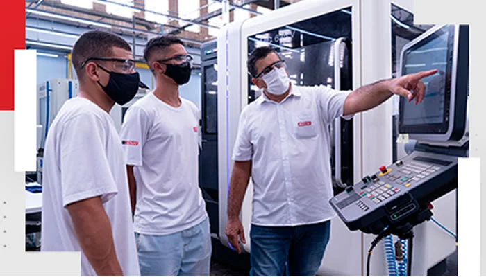

# manual-aluno
Missão: aumentar a competitividade da indústria por meio da educação profissional, inovação, tecnologia e empreendedorismo.
Mais de 80 anos de atuação.
Mais de 1 milhão de matrículas por ano.
90 unidades fixas e 78 escolas móveis no estado de São Paulo.
Oferece: Aprendizagem Industrial, Cursos Livres, Técnicos, Graduação, Pós-graduação e Educação Online.
Metodologia com integração entre teoria e prática.
Biblioteca
Cantina 
Secretaria (matrículas, documentos, passe escolar, etc.).
Área de Estágios (orientação e oportunidades).
Qualidade de Vida (apoio em casos de bullying, saúde mental, violência).
AAPM, CIPA, Conselho Escolar e Brigada de Incêndio.

